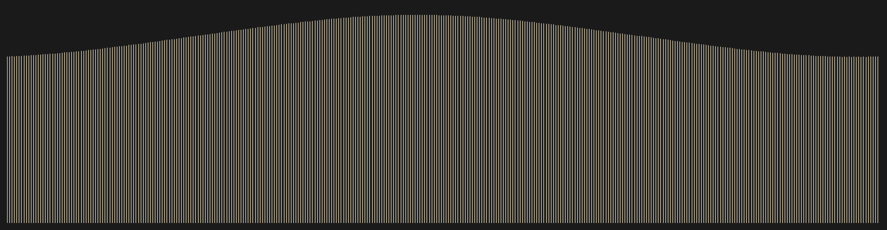

# The phenomenon



## The phenomenon
Daylight hours in Hong Kong rise and fall across the year, controlled by the Earth’s axial tilt and orbital movement around the Sun. The longest daylight appears near the summer solstice and the shortest near the winter solstice. I chose this dataset to visualise the subtle daily change of daylight over a full calendar year, turning numerical time records into a continuous visual rhythm.

## The source
Data is retrieved from Hong Kong Observatory’s sunrise and sunset API. The CSV file contains 365 rows; each row represents one calendar day in 2024. Columns include date, RISE for sunrise time and SET for sunset time, recorded in local time.

## What the picture shows
This image draws a vertical line for each day, where line height equals the length of daylight. The curve of line heights reveals the annual seasonal cycle of daylight. The visual hides exact timestamps of sunrise and sunset, and it discards weather conditions which do not affect astronomical sunrise and sunset.

## Run it

```
uv run fetch.py
uv run plot.py
```
